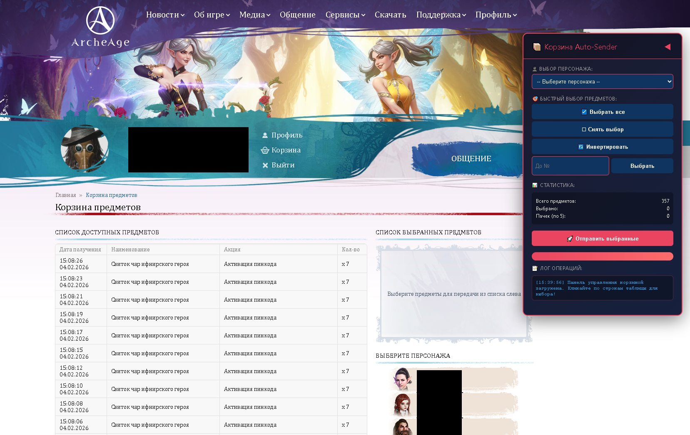
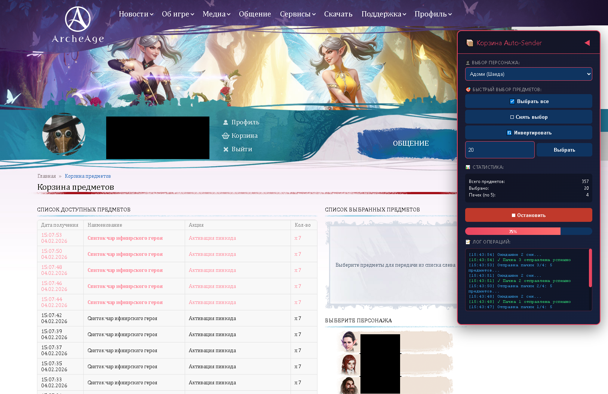

# 🎮 ArcheAge-Auto-Sender

[](https://www.tampermonkey.net/)
[](LICENSE)
[](https://github.com/yourusername/archeage-universal-tool)

---

## 📋 Содержание

- [Возможности](#-возможности)
- [Установка](#-установка)
- [Использование](#-использование)
  - [📦 Управление корзиной](#-управление-корзиной)
  - [🔑 Активация пин-кодов](#-активация-пин-кодов)

---

## ✨ Возможности

### 📦 Для страницы Корзины (`/cart`)
- ✅ **Пакетная отправка** — отправка предметов группами по 5 штук с задержкой между пачками
- 🎯 **Умный выбор** — выбор всех, снятие выбора, инвертирование, выбор до N-го предмета
- 🗑️ **Автоудаление** — успешно отправленные предметы автоматически удаляются из таблицы
- 📊 **Прогресс-бар** — визуальное отображение процесса отправки
- 🛑 **Аварийная остановка** — кнопка остановки в любой момент

### 🔑 Для страницы Пин-кодов (`/pin/activate`)
- 📁 **Загрузка из файла** — поддержка `.txt` файлов со списком пин-кодов
- 📜 **Прокручиваемый список** — визуальный список всех пинов с статусами обработки
- 🎨 **Цветовая индикация**:
  - 🔵 Синий — в очереди
  - 🔴 Красный — обработка
  - 🟢 Зеленый — успешно активирован
  - 🟠 Оранжевый — ошибка
- ⏱️ **Задержка между запросами** — 2 секунды между активациями (анти-DDoS)
- 📈 **Статистика** — счетчик обработанных/оставшихся пинов

---

## 🚀 Установка

### Шаг 1: Установите расширение Tampermonkey
- [Chrome](https://chrome.google.com/webstore/detail/tampermonkey/dhdgffkkebhmkfjojejmpbldmpobfkfo)
- [Firefox](https://addons.mozilla.org/firefox/addon/tampermonkey/)
- [Edge](https://microsoftedge.microsoft.com/addons/detail/tampermonkey/iikmkjmpaadaobahmlepeloendndfphd)

### Шаг 2: Установите скрипт
1. Откройте **[этот файл](https://github.com/Adfazer/ArcheAge-Auto-Sender/blob/main/ArcheAge%20Universal%20Tool%20(Cart%20%2B%20Pins)-3.0.user.js)** в браузере
2. Нажмите кнопку **Создать новый скрипт** в плагине Tampermonkey
3. Перенесите содержимое скрипта в появившееся окно.
4. Файл -> Сохранить

---

## 📖 Использование

### 📦 Управление корзиной



*Рис. 1: Панель управления корзиной в правом верхнем углу экрана*

1. **Перейдите** на страницу [archeage.ru/cart](https://archeage.ru/cart)
2. **Дождитесь появления** панели управления (правый верхний угол)
3. **Выберите персонажа** из выпадающего списка
4. **Выберите предметы** одним из способов:
   - Используйте кнопки "Выбрать все" / "Снять выбор"
   - Введите число N в поле "До №" для выбора первых N предметов
5. **Нажмите** 🚀 **"Отправить выбранные"**



*Рис. 2: Процесс отправки пачек предметов с индикатором прогресса*

&gt; ⚠️ **Важно:** После успешной отправки предметы автоматически исчезают из таблицы сайта. Ошибочные пачки остаются выделенными.

---

### 🔑 Активация пин-кодов


*Рис. 3: Интерфейс активации пин-кодов с загруженным списком*

1. **Подготовьте файл** `pins.txt` со списком пин-кодов (по одному на строку):
2. **Перейдите** на страницу [archeage.ru/pin/activate](https://archeage.ru/pin/activate/)
3. **Нажмите** 📂 **"Выбрать файл .txt"** и загрузите ваш файл(Каждый пин в файле с новой строки)
4. **Нажмите** ▶️ **"Начать активацию"**

> 💡 **Совет:** Список автоматически прокручивается к текущему обрабатываемому пину. Вы можете остановить процесс кнопкой ⏹ в любой момент.

---

## ⚙️ Технические детали

### Конфигурация (в начале скрипта)

```javascript
const CONFIG = {
 cart: {
     batchSize: 5,              // Количество предметов в пачке
     delayBetweenBatches: 2000, // Задержка между пачками (мс)
 },
 pin: {
     delayBetweenPins: 2000,    // Задержка между пинами (мс)
 }
};