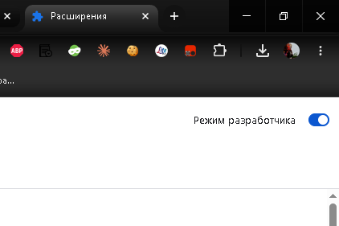
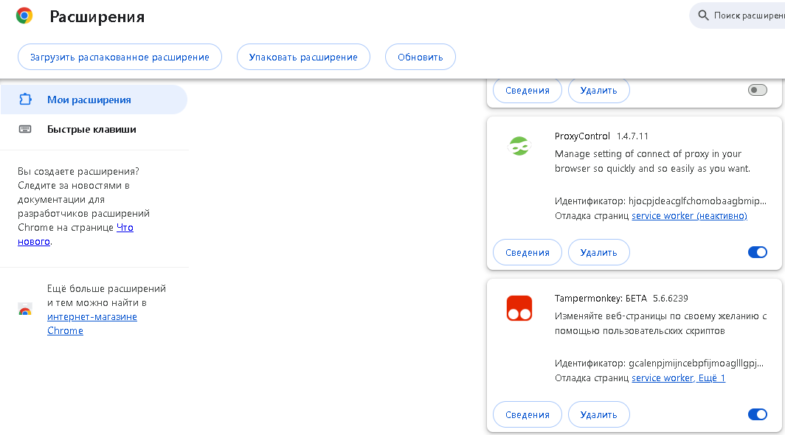
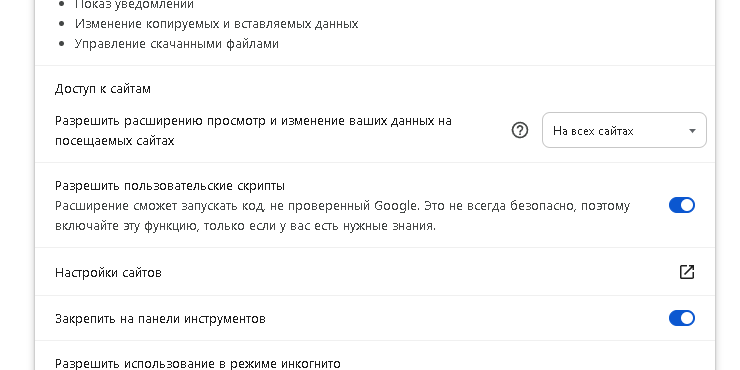
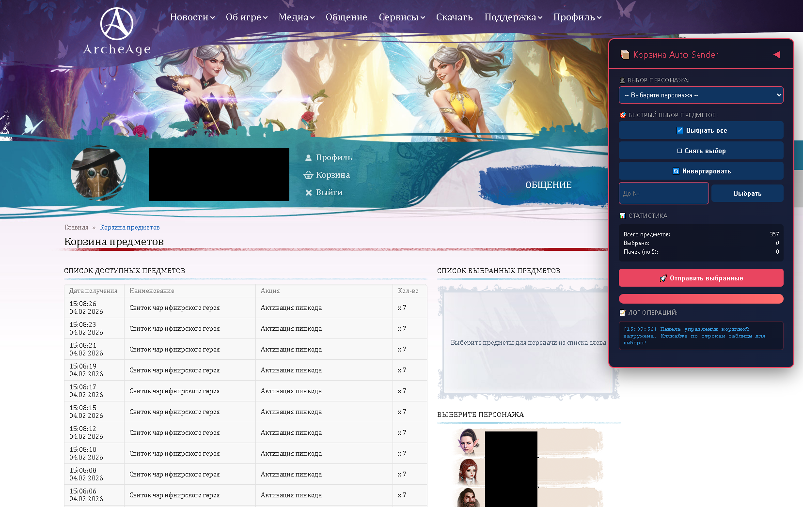
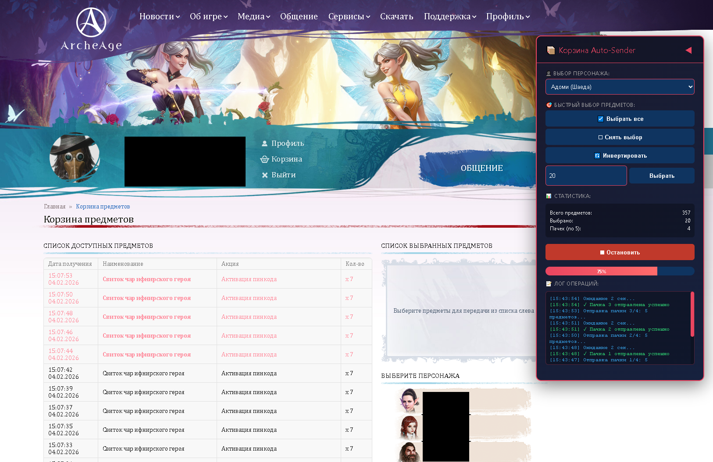
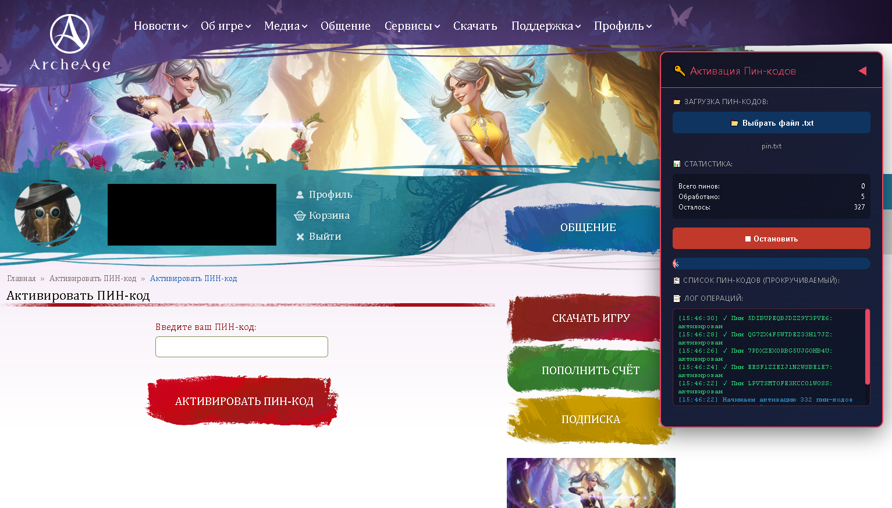
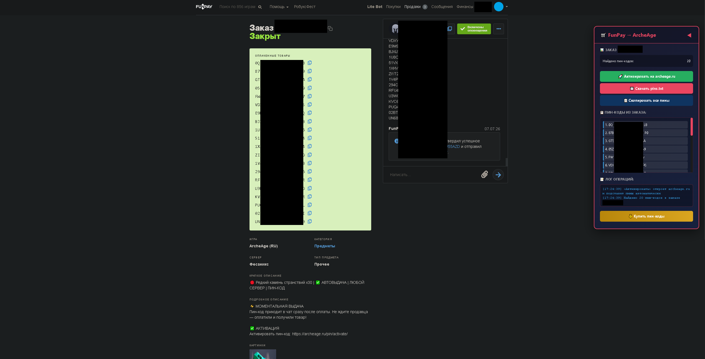

# 🎮 ArcheAge-Auto-Sender

[](https://www.tampermonkey.net/)
[](LICENSE)
[](https://github.com/Adfazer/ArcheAge-Auto-Sender)

---

## 📋 Содержание

- [Возможности](#-возможности)
- [Установка](#-установка)
- [Использование](#-использование)
  - [📦 Управление корзиной](#-управление-корзиной)
  - [🔑 Активация пин-кодов](#-активация-пин-кодов)
  - [🛒 Активация пин-кодов из заказа FunPay](#-активация-пин-кодов-из-заказа-FunPay)

---

## ✨ Возможности

### 📦 Для страницы Корзины (`/cart`)
- ✅ **Пакетная отправка** — отправка предметов группами по 5 штук с задержкой между пачками
- 🎯 **Умный выбор** — выбор всех, снятие выбора, инвертирование, выбор до N-го предмета
- 🏷️ **Выбор по названию** — фильтр по части названия (введите пару букв — список сразу сузится) и **множественный выбор**: отметьте галочками несколько названий сразу, кнопка «Отметить найденные» отмечает всё, что осталось по фильтру, «Снять отметки» очищает выбор. Одинаковые названия с разным количеством (например, «Осколок предела ×30» и «Осколок предела ×50») считаются разными стопками
- ⏳ **Учёт таймера передачи** — предметы с пометкой «Можно передать через: N мин.» подсвечиваются как недоступные, не выбираются и не отправляются; их количество видно в статистике
- 🛡️ **Честный разбор ответа сервера** — сервер отвечает HTTP 200 и когда предметы не переданы (например, `{"result":0,"msg":"Передача предметов на данный сервер временно недоступна."}`). Такой ответ показывается в логе как ошибка, строки из таблицы НЕ удаляются, а при недоступности сервера или истёкшей авторизации отправка сразу останавливается, чтобы не гонять пачки впустую
- 🗑️ **Автоудаление** — успешно отправленные предметы автоматически удаляются из таблицы (только при подтверждённом ответом сервера успехе)
- 📊 **Прогресс-бар** — визуальное отображение процесса отправки
- 🛑 **Аварийная остановка** — кнопка остановки в любой момент

### 🔑 Для страницы Пин-кодов (`/pin/activate`)
- 📁 **Загрузка из файла** — поддержка `.txt` файлов со списком пин-кодов
- 🛒 **Импорт из FunPay** — пины автоматически подставляются при переходе со страницы заказа FunPay
- 📜 **Прокручиваемый список** — визуальный список всех пинов с статусами обработки
- ✅ **Настоящая проверка результата** — скрипт разбирает ответ сервера и различает «успешно активирован», «некорректный пин-код», «пин уже активирован» и т.д. (сервер отвечает HTTP 200 даже на невалидные пины, поэтому по коду ответа судить нельзя). Распознаются все варианты формулировок сайта: «Пин-код активирован», «Пин код активирован», «Пин-код успешно активирован»
- 🎁 **Показ выданного предмета** — в логе и в статусе пина видно, что именно выдано, например: `✓ Пин <PIN-КОД>: активирован — [10 дней] Покровительство Сиоль`
- 🎨 **Цветовая индикация**:
  - 🔵 Синий — в очереди
  - 🔴 Красный — обработка
  - 🟢 Зеленый — успешно активирован
  - 🟠 Оранжевый — ошибка (с причиной: некорректный пин, уже активирован и т.д.)
  - 🟡 Желтый — ответ сервера не распознан, проверьте вручную
- ⏱️ **Задержка между запросами** — 2 секунды между активациями (анти-DDoS)
- 📈 **Статистика** — счетчики обработанных, успешных и ошибочных пинов

### 🛒 Для страницы заказа FunPay (`funpay.com/orders/...`)
- 🔍 **Автопоиск пинов** — скрипт находит все пин-коды в блоке «Оплаченные товары»
- 💾 **Скачивание файла** — кнопка сохраняет `pins_<номер заказа>.txt` для активации в любой момент
- 🚀 **Активация в один клик** — кнопка открывает archeage.ru/pin/activate и автоматически подставляет пины из заказа, останется нажать «Начать активацию»
- 📋 **Копирование** — все пины в буфер обмена одной кнопкой

---

## 🚀 Установка

### Шаг 1: Установите расширение Tampermonkey
- [Chrome](https://chrome.google.com/webstore/detail/tampermonkey/dhdgffkkebhmkfjojejmpbldmpobfkfo)
- [Firefox](https://addons.mozilla.org/firefox/addon/tampermonkey/)
- [Edge](https://microsoftedge.microsoft.com/addons/detail/tampermonkey/iikmkjmpaadaobahmlepeloendndfphd)

### Шаг 2: Установите скрипт
1. Откройте **[ссылку на установку](https://raw.githubusercontent.com/Adfazer/ArcheAge-Auto-Sender/main/archeage-universal-tool.user.js)** — Tampermonkey сам откроет окно установки
2. Нажмите **Установить**

> 🔄 **Автообновления:** при установке по ссылке выше Tampermonkey будет сам проверять новые версии скрипта (метаданные `@updateURL`/`@downloadURL`) и предлагать обновление — ничего делать не нужно.
>
> 💡 **Как проверить, что обновилось:** версия показана в заголовке панели скрипта, например `v3.4`. Если нужно обновиться, не дожидаясь автоматической проверки — откройте панель Tampermonkey → «Утилиты» → «Проверить обновления скриптов» (или вкладка «Установленные скрипты» → значок обновления у нужного скрипта).
>
> ⚠️ Если вы раньше устанавливали скрипт копированием кода через «Создать новый скрипт» — удалите старый скрипт и установите его один раз по ссылке, иначе автообновления работать не будут.

### Шаг 3: Включить режим разработчика
1. Откройте **chrome://extensions/** 
2. Поставте галочку **"Режим разработчика"** в правом верхнем углу.


3. Найдите плагин Tampermonkey в списке установленых плагинов и нажмите **"Сведения"**.


4. В открывшемся окне нажмите **"Разрешить пользовательские скрипты"**.


---

## 📖 Использование

### 📦 Управление корзиной



*Рис. 1: Панель управления корзиной в правом верхнем углу экрана*

1. **Перейдите** на страницу [archeage.ru/cart](https://archeage.ru/cart)
2. **Дождитесь появления** панели управления (правый верхний угол)
3. **Выберите персонажа** из выпадающего списка
4. **Выберите предметы** одним из способов:
   - Используйте кнопки "Выбрать все" / "Снять выбор"
   - Введите число N в поле "До №" для выбора первых N предметов
   - Блок **"🏷️ Выбор по названию"**: начните вводить часть названия в поле фильтра — список под ним сразу сузится (в счётчике видно «Показано: X из Y»). Отметьте галочками одно **или сразу несколько** названий, при необходимости нажмите "☑️ Отметить найденные" (отметит всё, что осталось по фильтру) или "✖ Снять отметки". Затем нажмите **"☑️ Выбрать только эти"** — будут отмечены только предметы выбранных названий, с остальных выбор снимется. Предметы, которые сейчас на таймере передачи, не отмечаются и не отправляются
5. **Нажмите** 🚀 **"Отправить выбранные"**



*Рис. 2: Процесс отправки пачек предметов с индикатором прогресса*

&gt; ⚠️ **Важно:** После успешной отправки предметы автоматически исчезают из таблицы сайта. Ошибочные пачки остаются выделенными.

---

### 🔑 Активация пин-кодов



*Рис. 3: Интерфейс активации пин-кодов с загруженным списком*

1. **Подготовьте файл** `pins.txt` со списком пин-кодов (по одному на строку):
2. **Перейдите** на страницу [archeage.ru/pin/activate](https://archeage.ru/pin/activate/)
3. **Нажмите** 📂 **"Выбрать файл .txt"** и загрузите ваш файл(Каждый пин в файле с новой строки)
4. **Нажмите** ▶️ **"Начать активацию"**

> 💡 **Совет:** Список автоматически прокручивается к текущему обрабатываемому пину. Вы можете остановить процесс кнопкой ⏹ в любой момент.

> ⚠️ **Важно:** перед активацией авторизуйтесь на archeage.ru — иначе все пины получат статус «Требуется авторизация на сайте».

---

### 🛒 Активация пин-кодов из заказа FunPay



*Рис. 4: Интерфейс парсинга пин-кодов из заказа FunPay*

1. **Откройте страницу заказа**, например `https://funpay.com/orders/XXXXXXXX/`
2. **Дождитесь появления** панели «🛒 FunPay → ArcheAge» (правый верхний угол) — скрипт сам найдет пин-коды в блоке «Оплаченные товары»
3. Дальше два варианта:
   - 🚀 **"Активировать на archeage.ru"** — откроется страница активации, пины подставятся автоматически, останется нажать ▶️ **"Начать активацию"**
   - 💾 **"Скачать pins.txt"** — сохранит файл с пинами для активации позже (через обычную загрузку файла)

> 💡 Переданные пины «живут» 10 минут — если страница активации не была открыта за это время, просто нажмите кнопку в заказе еще раз.

---

## ⚙️ Технические детали

### Конфигурация (в начале скрипта)

```javascript
const CONFIG = {
 cart: {
     batchSize: 5,              // Количество предметов в пачке
     delayBetweenBatches: 2000, // Задержка между пачками (мс)
 },
 pin: {
     delayBetweenPins: 2000,    // Задержка между пинами (мс)
 }
};
```

---

## 📅 История изменений

### v3.7 (22.09.2026)
- 🛡️ **Исправлена обработка отказа сервера при отправке предметов.** Сервер отвечает HTTP 200 даже когда передача не состоялась: `{"result":0,"msg":"Передача предметов на данный сервер временно недоступна."}`. Раньше любой такой ответ считался успехом — скрипт писал «Пачка отправлена успешно» и убирал строки из таблицы, хотя предметы оставались непереданными. Теперь:
  - успех подтверждается только признаком `result: 1` в ответе;
  - текст отказа сервера выводится в лог, строки из таблицы не удаляются, галочки сохраняются — отправку можно просто повторить;
  - отказы «передача … временно недоступна» и «требуется авторизация» останавливают отправку сразу (остальные пачки не гоняются впустую) с пояснением в логе;
  - прочие отказы фиксируются по пачке, остальные пачки продолжают уходить;
  - нераспознанный ответ считается «требует проверки», а не успехом — ничего не удаляется.
- 🗑️ Автоудаление строк теперь возможно только при подтверждённом ответом успехе.

### v3.6 (22.09.2026)
- 🔍 **Фильтр по названию в корзине** — над списком названий появилось поле поиска: вводите часть названия, список сужается на лету (счётчик показывает «Показано: X из Y»). Больше не нужно листать длинный список вручную.
- ✅ **Множественный выбор названий** — в списке теперь галочки, можно отметить сразу несколько названий и одним нажатием «Выбрать только эти» отметить предметы всех выбранных названий. Кнопка подсвечивает количество отмеченных.
- ➕ Вспомогательные кнопки: «☑️ Отметить найденные» (отметить всё, что осталось по фильтру) и «✖ Снять отметки».
- Мелочи: названия, которых больше нет в корзине (отправлены), автоматически убираются из отметок; в списке у каждого названия видно, сколько предметов доступно и сколько на таймере; экранирование кавычек в названиях.

### v3.5 (22.09.2026)
- 🪵 **Порядок строк в логе — как в обычном логе.** Новые строки добавляются вниз, а не вверх; лог автоматически прокручивается к свежим записям (если вы не отлистали его вверх — тогда позиция чтения сохраняется). Лимит в 50 строк остался, теперь сверху отбрасываются самые старые записи.
- Исправление действует во всех трёх панелях: корзина, активация пин-кодов, FunPay.

### v3.4 (22.09.2026)
- 🐛 **Исправлено распознавание ответа при активации пинов.** Сайт изменил формулировку успешного ответа на «Пин код активирован» (пробел вместо дефиса) — скрипт помечал такие пины как «Ответ не распознан — проверьте вручную». Теперь распознаются все варианты: «Пин-код активирован», «Пин код активирован», «Пинкод активирован», «успешно активирован», а также ответы в JSON.
- 🎁 **Показ выданного предмета** — в логе и в статусе пина теперь видно, что выдал сайт: `✓ Пин <PIN>: активирован — [10 дней] Покровительство Сиоль`.
- 🏷️ **Версия скрипта в заголовке панели** — `v3.4`, чтобы сразу видеть, что автообновление сработало.
- ⚙️ Ответы с ошибками («уже активирован», «не активирован», «истёк», «некорректный пин-код», «не найден», «требуется авторизация») определяются независимо от формулировки и не могут быть приняты за успех.
